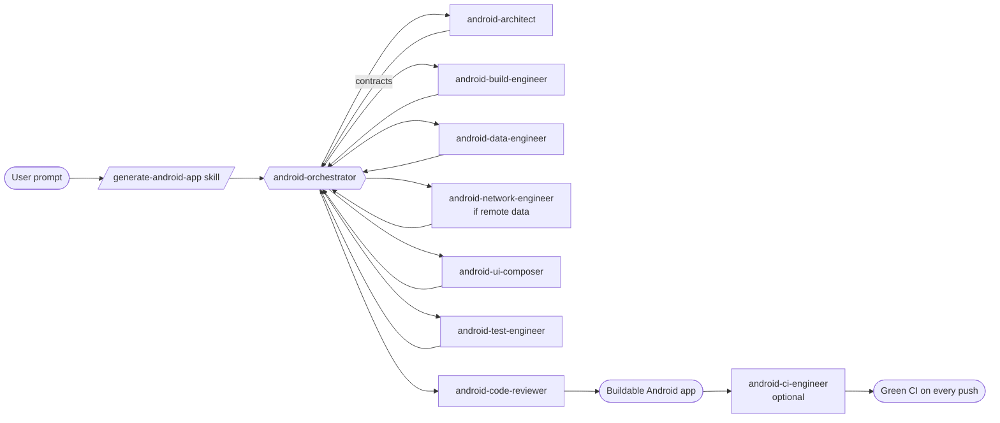

# Android Project Generator — a Claude Code subagent practice repo

This repository is a **practice playground for Claude Code subagents, skills, and
orchestration**. It contains a complete, multi-agent system that turns a single
natural-language prompt into a buildable Android app.

> Example: `/generate-android-app a habit tracker with daily reminders`
> → a full Kotlin + Jetpack Compose + Room + Hilt project, scaffolded by a team
> of cooperating subagents.

Nothing here is a single mega-prompt. The point of the exercise is to show how
work is **decomposed across many specialized agents and skills**, coordinated by
an orchestrator — exactly the pattern Claude Code is built for.

---

## What's in here

```
.
├── .claude/
│   ├── agents/                 # 9 subagents (the workers + the coordinator)
│   │   ├── android-orchestrator.md
│   │   ├── android-architect.md
│   │   ├── android-build-engineer.md
│   │   ├── android-data-engineer.md
│   │   ├── android-network-engineer.md
│   │   ├── android-ui-composer.md
│   │   ├── android-test-engineer.md
│   │   ├── android-ci-engineer.md
│   │   └── android-code-reviewer.md
│   └── skills/                 # 6 skills (the command surface)
│       ├── generate-android-app/SKILL.md   # full app from a prompt
│       ├── android-scaffold/SKILL.md       # empty buildable shell
│       ├── compose-screen/SKILL.md         # add one screen
│       ├── gradle-setup/SKILL.md           # fix/create build config
│       ├── setup-ci/SKILL.md               # add GitHub Actions CI
│       └── android-conventions/SKILL.md    # the shared rulebook
├── templates/                  # known-good Gradle + Kotlin reference files
│   ├── settings.gradle.kts
│   ├── libs.versions.toml
│   ├── root.build.gradle.kts
│   ├── app.build.gradle.kts
│   ├── AndroidManifest.xml
│   ├── kotlin/                 # MVVM screen / viewmodel / contract templates
│   ├── retrofit/               # API service / DTO / NetworkModule / offline-first repo
│   └── ci/                     # GitHub Actions workflow
├── docs/
│   ├── ARCHITECTURE.md         # how the pipeline works (diagrams)
│   └── WHY.md                  # why it's designed this way (diagrams)
└── README.md
```

---

## The cast

### Subagents (`.claude/agents/`)

| Agent | Role | Model | Why it's separate |
|-------|------|-------|-------------------|
| **android-orchestrator** | Plans the app, delegates, integrates, reports | opus | Coordination is its own skill; mixing it with coding muddies both |
| **android-architect** | Module layout, package tree, **contracts** | opus | Decisions made once, up front, bind everyone else |
| **android-build-engineer** | Gradle, version catalog, manifest | sonnet | Build/version compatibility is a deep, narrow specialty |
| **android-data-engineer** | Room entities, DAOs, repositories | sonnet | Persistence has its own idioms and failure modes |
| **android-network-engineer** | Retrofit API, DTOs, NetworkModule, offline-first | sonnet | Networking, serialization & error handling are their own domain |
| **android-ui-composer** | Compose screens, ViewModels, nav, theme | sonnet | UI is the largest surface; isolate its big context |
| **android-test-engineer** | Unit + instrumented tests | sonnet | Tests should be written against contracts, not by the author |
| **android-ci-engineer** | GitHub Actions: build + test + lint on every push | sonnet | Automated proof a generated app compiles |
| **android-code-reviewer** | Final cross-layer quality gate | opus | A fresh reviewer catches what an author can't |

### Skills (`.claude/skills/`)

| Skill | Use it when… |
|-------|--------------|
| **generate-android-app** | You want a whole app from one prompt |
| **android-scaffold** | You want just an empty, buildable shell |
| **compose-screen** | You want to add one screen to an existing app |
| **gradle-setup** | The build is broken or missing |
| **setup-ci** | You want GitHub Actions to build/test the app on every push |
| **android-conventions** | You need the shared rules every agent follows |

---

## How to use it

1. Open this repo in **Claude Code**.
2. Run the entry skill with your idea:
   ```
   /generate-android-app a recipe box with categories and a shopping list
   ```
3. The `generate-android-app` skill invokes the **orchestrator**, which plans the
   app and delegates to the specialists. You'll get a complete project tree.
4. Build it: `./gradlew assembleDebug`.

To go smaller: `/android-scaffold`, then `/compose-screen Settings`.

---

## The big picture



Read **`docs/WHY.md`** for the reasoning behind every design choice (with lots of
diagrams), and **`docs/ARCHITECTURE.md`** for how the pipeline executes.
