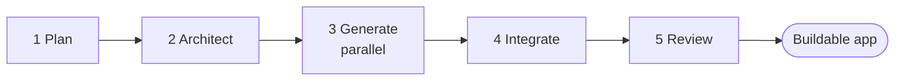
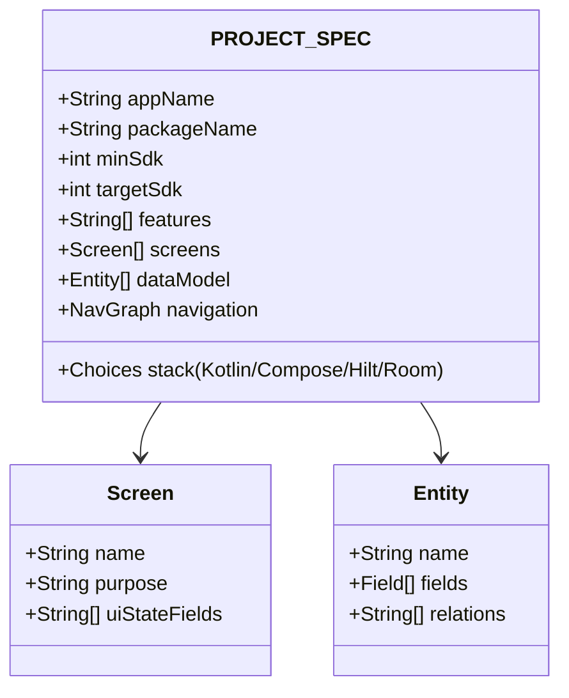
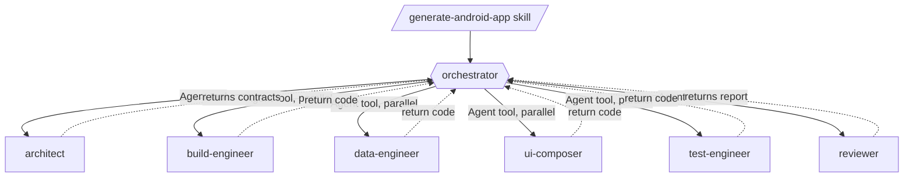
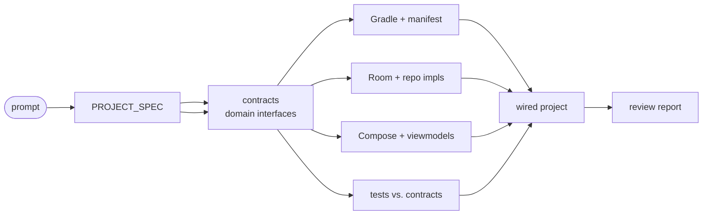
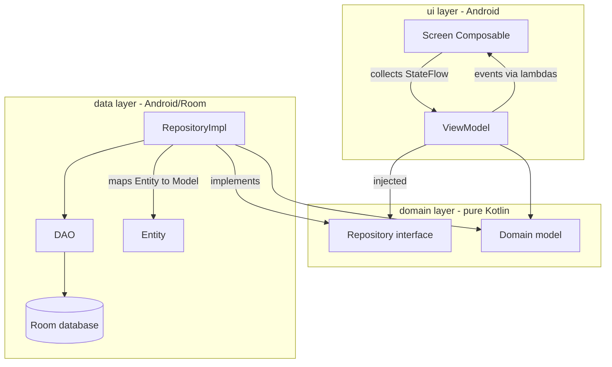
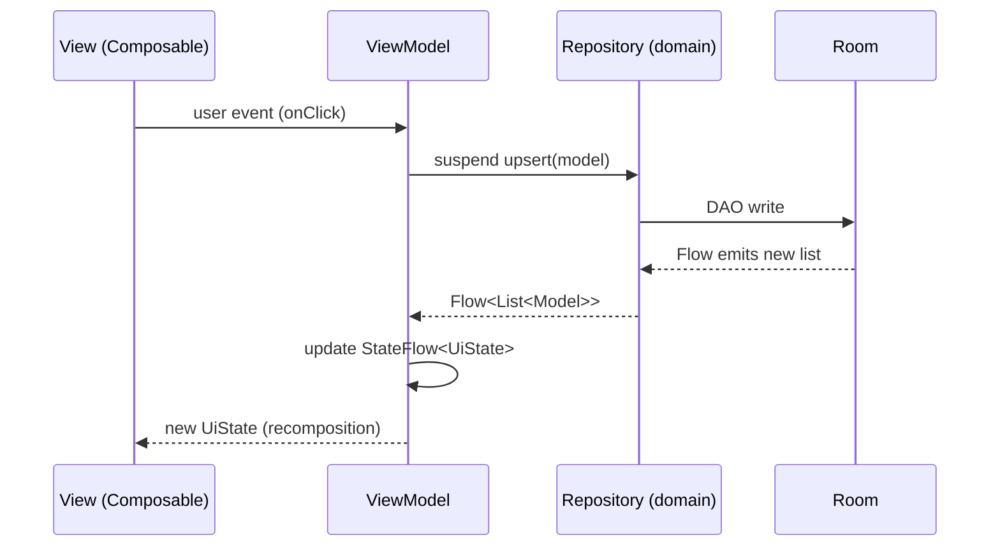
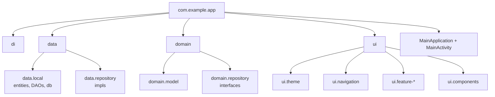
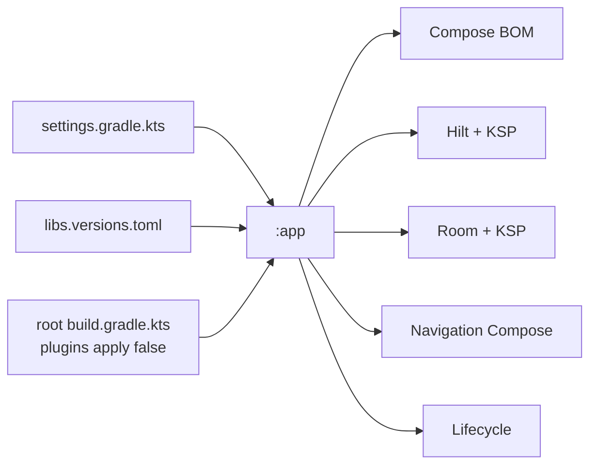
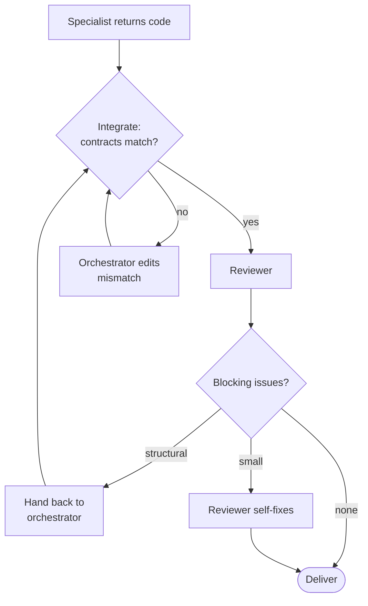
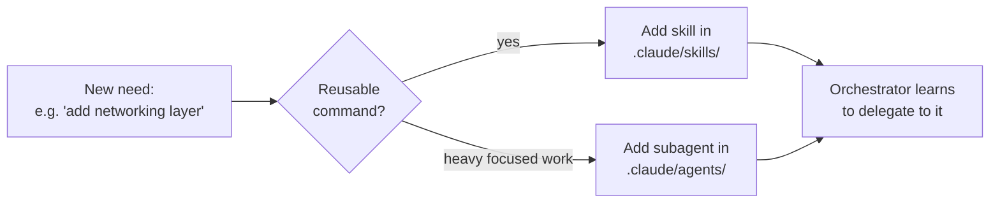

# Architecture — how the pipeline executes

This document describes the runtime mechanics of the generator: the stages, what
flows between them, and the structure of the app it produces.

For the *reasoning* behind these choices, see [`WHY.md`](./WHY.md).

---

## 1. The five stages

| Stage | Owner | Input | Output |
|-------|-------|-------|--------|
| 1. Plan | orchestrator | user prompt | `PROJECT_SPEC` |
| 2. Architect | architect | `PROJECT_SPEC` | package tree + contracts |
| 3. Generate | build / data / ui / test | spec + contracts | layer code |
| 4. Integrate | orchestrator | all layer code | wired project |
| 5. Review | reviewer | wired project | fixes + report |

---

## 2. The PROJECT_SPEC contract

Everything downstream depends on a single shared artifact the orchestrator writes
in stage 1. It is saved to `docs/PROJECT_SPEC.md` for the run.

Because all agents receive the *same* spec, their outputs line up without the
agents communicating directly.

---

## 3. Delegation flow (who calls whom)

Only the orchestrator uses the `Agent` tool. Specialists have file + search tools
but **not** `Agent` — they cannot spawn further agents, which keeps the call
graph shallow and predictable.

---

## 4. Data flow between stages

---

## 5. The generated app's architecture (MVVM + Clean-ish)

This is the shape every generated project takes.

**Dependency rule:** arrows of dependency point inward to `domain`. The UI and
data layers depend on domain interfaces; domain depends on nothing Android.

---

## 6. Unidirectional data flow inside a screen

---

## 7. Generated package layout

---

## 8. Build dependency graph (Gradle)

---

## 9. Failure handling

---

## 10. Extending the system

To add a capability, add a **skill** (entry point) and/or a **subagent** (worker):

Examples of natural extensions: an `android-network-engineer` (Retrofit/Ktor),
an `android-ci-engineer` (GitHub Actions), or a `play-store-prep` skill.
