# Why this design? (with diagrams)

This document explains **why** the Android generator is built as many subagents +
skills + an orchestrator, rather than one big prompt. Each section pairs the
reasoning with a diagram.

---

## 1. The core problem: one prompt can't do it well

A naive approach is a single giant prompt: *"generate a full Android app."* That
fails for predictable reasons.

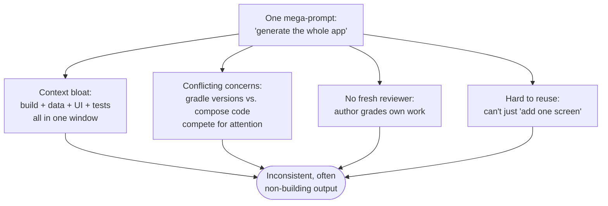

Splitting the job fixes each failure mode:

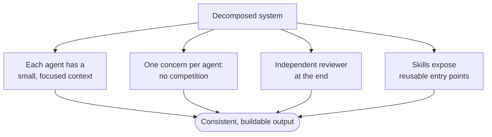

---

## 2. Separation of concerns → one agent per layer

An Android app has naturally separable layers. We map **one specialist subagent
to each layer**, mirroring how a real engineering team is structured.

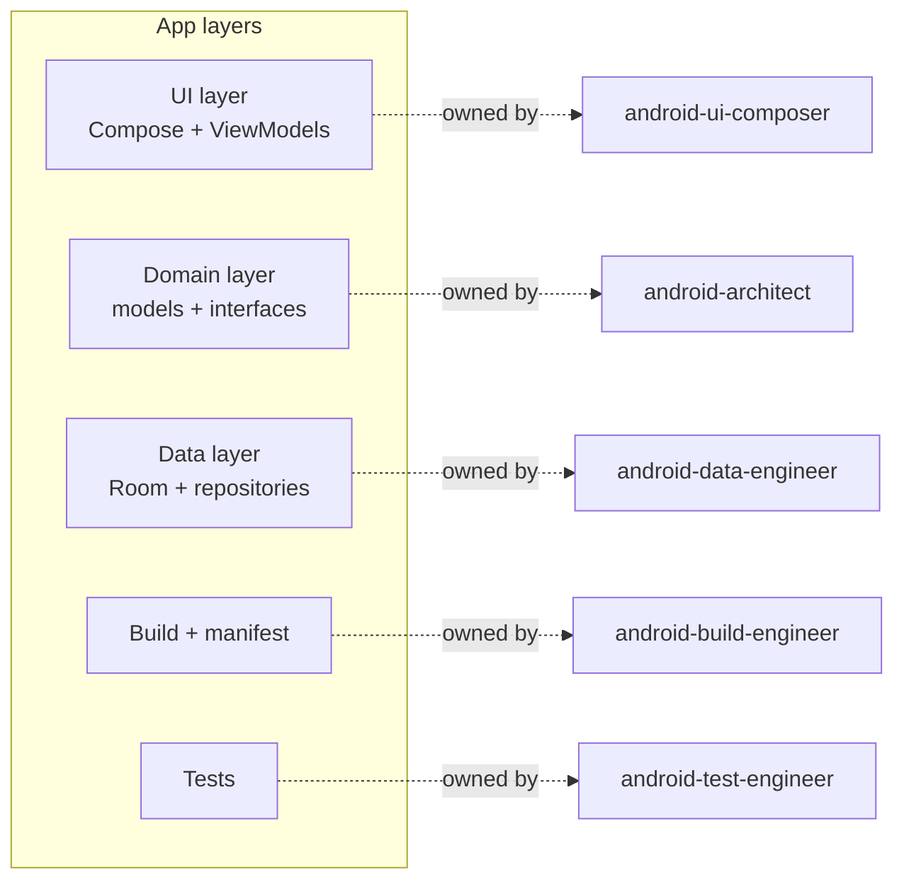

**Why this matters:** each agent's system prompt can be dense with the idioms and
failure modes of *just* its layer. The build engineer obsesses over
AGP↔Kotlin↔Compose version compatibility; the UI composer obsesses over
unidirectional data flow. Neither dilutes the other.

---

## 3. The orchestrator: a coordinator, not a coder

The orchestrator never writes feature code. Its only job is **decompose →
delegate → integrate → review**. This keeps coordination logic out of the
specialists and keeps specialists out of planning.

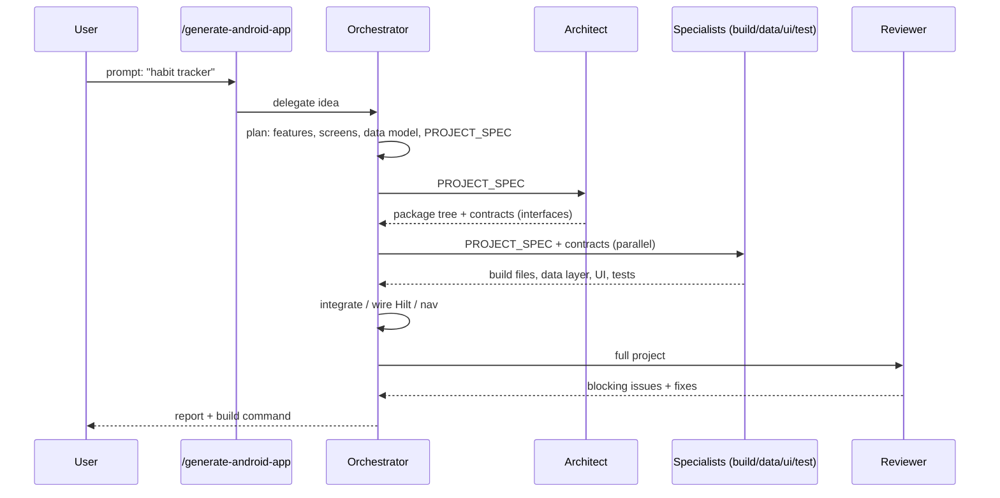

---

## 4. Contracts are the secret to parallelism

The architect produces **interfaces** (domain repositories) *before* any
implementation. Because the data engineer and UI composer both code against the
same interface, they can work **in parallel** and still fit together.

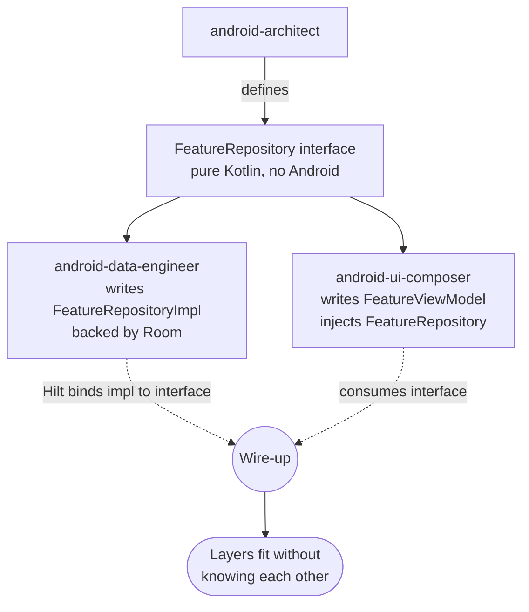

This is the dependency-inversion principle applied to *agent coordination*: the
seam (interface) lets two agents who never talk to each other produce compatible
code.

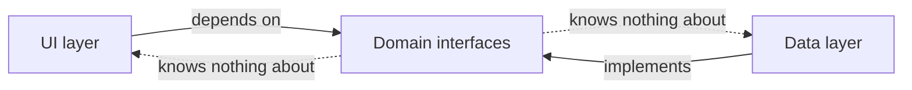

---

## 5. Why skills *and* subagents (they're different tools)

Skills and subagents solve different problems. We use both deliberately.

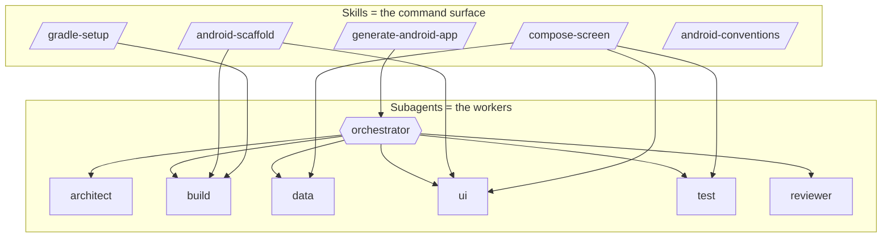

| | Skill | Subagent |
|---|-------|----------|
| **What it is** | A discoverable, named command (`/foo`) | A worker with its own context + tools |
| **Runs in** | The main conversation | An isolated context window |
| **Best for** | A stable entry point / workflow | Heavy, focused work that shouldn't pollute main context |
| **Here** | How a user *starts* a task | How the task *gets done* |

The skill is the **doorknob**; the subagents are the **room behind it**. A user
shouldn't have to know which seven agents run — they type one command.

---

## 6. Why a separate reviewer agent

The agent that writes code is the worst judge of it — it's anchored on its own
choices and its context is full of justifications. A **fresh reviewer** with an
empty context and an adversarial checklist catches what authors miss.

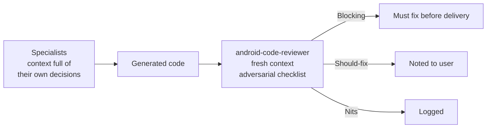

---

## 7. Model selection per agent

Coordination and judgment get the strongest model; mechanical generation uses a
faster one. This is a cost/latency vs. capability trade-off made per role.

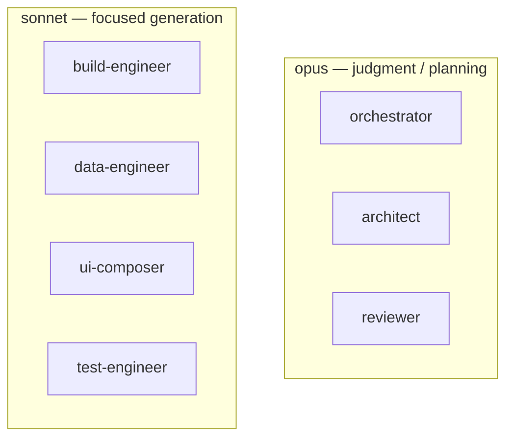

---

## 8. Why templates exist

LLMs drift on exact Gradle versions and plugin syntax — the #1 cause of a
generated Android app failing to build. The `templates/` directory pins a
**known-good** baseline so agents adapt rather than invent.

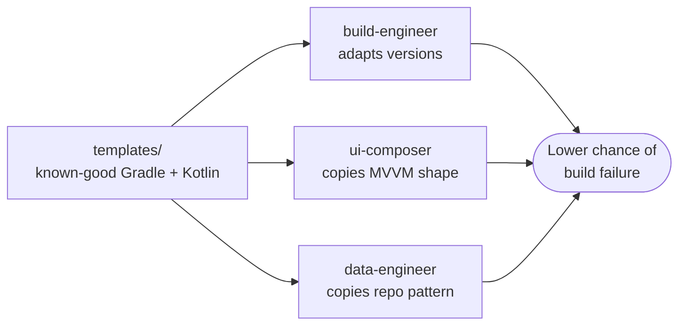

---

## 9. How it all composes

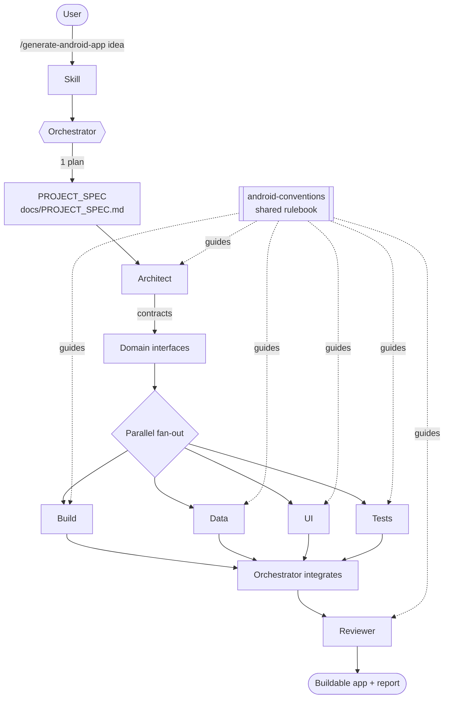

The `android-conventions` skill is the connective tissue — every agent conforms
to it, which is *why* independently generated layers end up consistent.

---

## 10. Why a dedicated network engineer

Networking is its own discipline: serialization, timeouts, retries, error
mapping, and the offline/online dance. Folding it into the data engineer would
bloat that agent with two unrelated concerns (local DB *and* HTTP). So it gets
its own specialist — and, crucially, it introduces a **third model type**.

```mermaid
flowchart LR
    JSON[(Remote JSON)] --> DTO[DTO<br/>@Serializable<br/>data.remote.dto]
    DTO -->|mapper| MODEL[Domain model<br/>pure Kotlin]
    MODEL -->|mapper| ENT[Entity<br/>@Entity<br/>data.local]
    ENT --> DB[(Room)]
    MODEL --> VM[ViewModel]
    style MODEL fill:#1f6f3f,color:#fff
```

The rule the agent enforces: **DTO ≠ Entity ≠ domain model**, mapped at each
boundary. A DTO must never reach a ViewModel. This keeps a change in the API's
JSON shape from rippling into the UI.

### Offline-first: Room stays the single source of truth

When the app both fetches and persists, the UI never observes the network
directly — it observes Room. The network only *fills* Room.

```mermaid
sequenceDiagram
    participant V as Screen
    participant VM as ViewModel
    participant R as Repository
    participant DB as Room (source of truth)
    participant NET as RemoteDataSource (Retrofit)

    V->>VM: open / pull-to-refresh
    VM->>R: observeAll()  (cold start)
    R-->>VM: Flow from Room (cached)
    VM->>R: refresh()
    R->>NET: fetchFeatures()
    NET-->>R: NetworkResult.Success(list) / Error
    R->>DB: upsertAll(list)
    DB-->>R: Flow re-emits
    R-->>VM: fresh data (no extra call)
    Note over VM,V: One observable path; offline shows last cache
```

This is why networking still codes against the **same domain repository
interface** — the UI doesn't know or care whether data came from disk or the
wire. The network engineer slots in behind the existing contract.

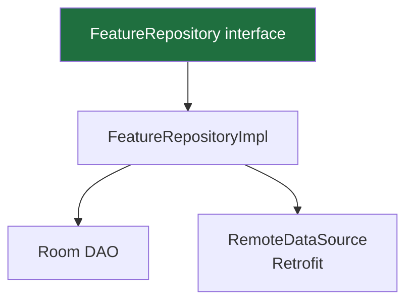

## 11. Why CI (Continuous Integration)

> Note: you asked about "android cli" — I read that as **CI** (the GitHub Actions
> idea I offered). Here's why it earns its place in a *code generator*.

The single biggest failure mode of any code generator is output that **looks
correct but doesn't compile**. An LLM can produce plausible Gradle and Kotlin
that has a subtly wrong version pin or a missing plugin. You only find out when
you build it.

CI closes that gap. It builds the generated app in a **clean cloud machine** on
every push and pull request — no dependence on whether you have an Android SDK
installed locally.

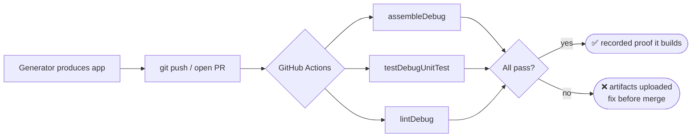

What this buys a generation pipeline specifically:

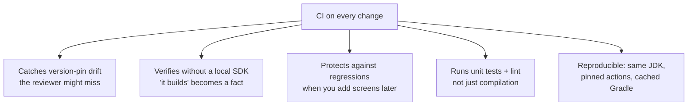

It pairs naturally with the **reviewer**: the reviewer reasons about the code;
CI *executes* it. Reasoning can be wrong; a green build cannot.

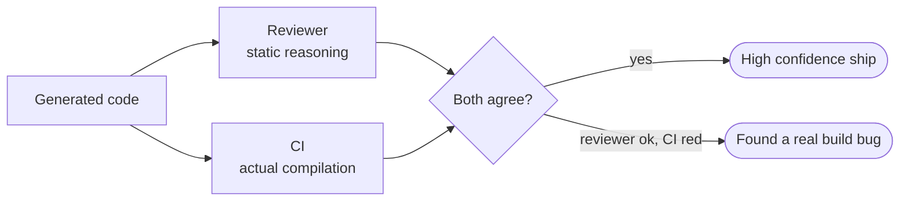

This is why CI is exposed both as an orchestrator stage *and* a standalone
`/setup-ci` skill — it's useful on any project, not just freshly generated ones.

## Summary of the trade-offs

| Decision | Benefit | Cost we accept |
|----------|---------|----------------|
| Many subagents vs. one prompt | Focus, smaller contexts, parallelism | More orchestration plumbing |
| Contracts before code | Independent, compatible layers | An extra up-front stage |
| Separate reviewer | Catches author blind spots | One more pass |
| Skills as entry points | Simple UX, reusable workflows | More files to maintain |
| Pinned templates | Reliable builds | Must keep versions current |
| Per-agent model choice | Cost/speed where it's fine, power where it counts | Slightly more config |
| Dedicated network engineer | Clean DTO/Entity/domain separation; offline-first | A third model type to map |
| CI on every push | Executes the code; proves it builds without a local SDK | CI minutes; a workflow to maintain |
