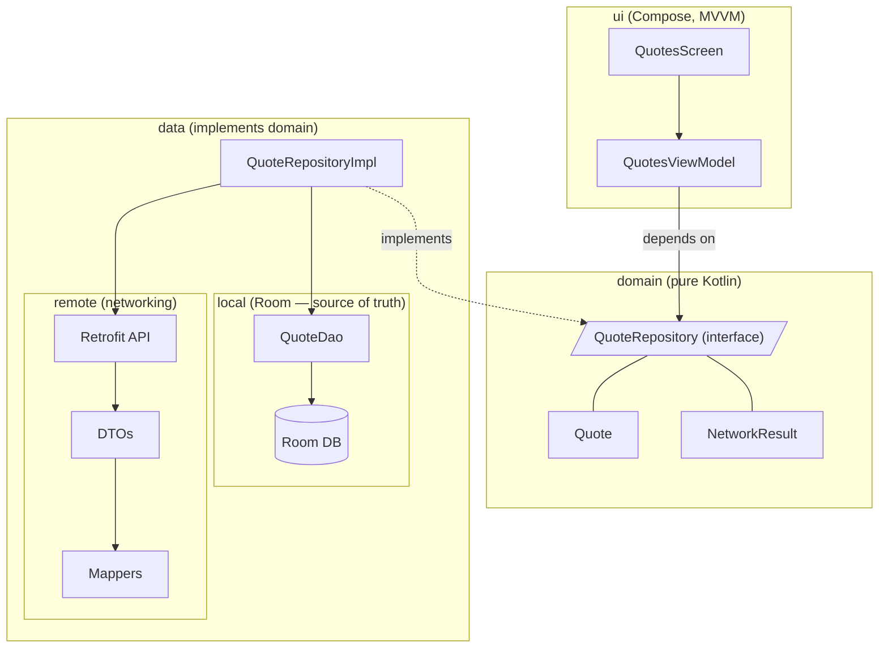

# Architecture — Daily Quotes

MVVM + Repository with a thin, pure-Kotlin **domain** layer. The dependency rule
is one-directional: **UI depends on domain**, **data implements domain**, and
domain depends on neither. All networking lives inside the data layer; the UI
never sees a DTO, a Room entity, or a raw exception.

## Layers

### domain (pure Kotlin — no Android, no Room, no Retrofit)
- `domain/model/Quote.kt` — the single model that crosses every layer boundary.
- `domain/util/NetworkResult.kt` — `Success` / `Error` wrapper for fallible ops.
- `domain/repository/QuoteRepository.kt` — the contract both sides build against.

This is the seam. The data and UI specialists code against `QuoteRepository`
independently; neither needs the other's concrete classes.

### data (implements the domain contract)
- `data/local/` — Room entity, DAO, database (single source of truth).
- `data/remote/api/`, `data/remote/dto/`, `data/remote/mapper/` — Retrofit API,
  network DTOs, and DTO↔domain/entity mappers.
- `data/repository/` — `QuoteRepositoryImpl`: combines DAO + remote, offline-first.
- `di/` — Hilt modules (`DataModule`, `NetworkModule`) binding impls to interfaces.

Offline-first flow: the UI observes Room via `observeQuotes(...)`; `refresh()`
pulls from the API, maps DTO → entity, and upserts into Room, which re-emits to
any active `Flow` collectors. `setFavorite(...)` writes straight to Room.

### ui (depends only on domain)
- `ui/theme/`, `ui/navigation/` — Material 3 theme and a single-route `NavHost`.
- `ui/quotes/` — `QuotesScreen` + `QuotesViewModel` (state down via
  `StateFlow<UiState>`, events up via lambdas).
- `ui/components/` — reusable stateless composables.

The ViewModel depends on `QuoteRepository` only, never on a concrete data class.

## Diagram

Arrows point in the direction of dependency. UI → domain ← data: the domain is
the stable center, and networking is fully contained within the data layer.
